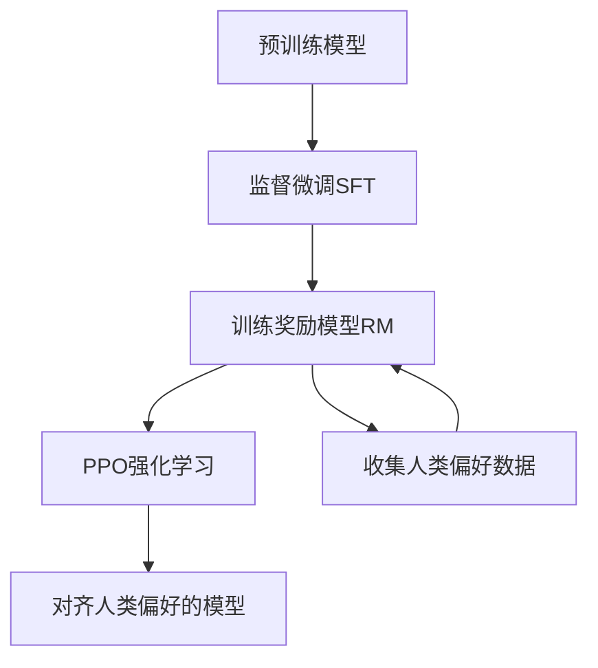
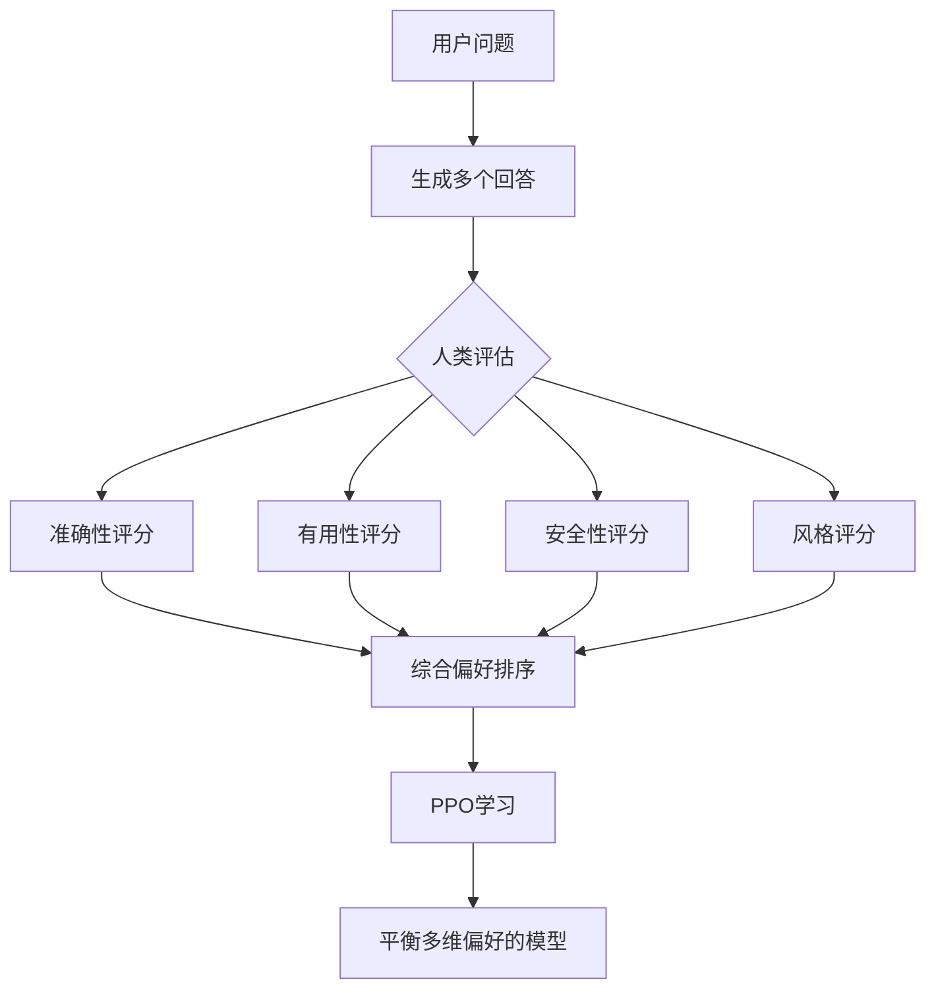

# 会话笔记 - 2025-12-19

## 会话概述
- **日期**: 2025-12-19
- **持续时间**: 120分钟
- **形式**: 一对一辅导
- **主要主题**: 微调算法详解与PPO算法原理、大模型评估系统设计

## 学习者提出的问题
1. "LoRA、QLoRA、P-tuning和PPO这几种微调方法有什么区别？我应该什么时候选择哪种方法？"
2. "P-tuning的原理是什么？它和LoRA有什么不同？"
3. "能给我一个P-tuning的实际应用案例吗？比如如何用P-tuning微调ChatGLM2-6B模型？"
4. "P-tuning适合在什么场景下使用？有什么优势？"
5. "整理并保存今天的学习内容和学习进度"
6. "我对PPO算法理解模糊，能通过举例方式讲解一下它的原理吗？"
7. "这个问题我现在还回答不了，传统的监督微调细节不是很清楚，如：用监督微调来对齐人类偏好，如何准备训练数据，数据是什么形式、如何进行微调、运用到哪些算法等。"
8. "今天先到这吧，保存一下学习记录"
9. "结合之前的学习历史记录问我一个问题"
10. "模型评估的知识我还没了解过，给我讲讲吧"
11. "都不了解"
12. "1、有参考答案的、有规则的选择自动评估 2、评估代码生成可以考虑代码语法，执行性能，易读性，易维护性"
13. "结合用户满意或不满意的维度，调整评估分值的设置"
14. "设置优化率，类似ppo的裁剪功能，优化前后差距过大"
15. "总结一下今天的学习内容，并更新学习进度"

## 解释前学习者的初始理解
- 对微调算法有基本了解，但不清楚不同方法的具体区别和适用场景
- 对P-tuning原理和应用不熟悉
- 对PPO算法理解模糊，特别是其在RLHF中的应用
- 对传统监督微调与PPO在人类偏好对齐中的区别不清楚
- 对模型评估系统完全没有了解，包括评估方法、评估维度和评估系统设计

## 解释的概念和教学方法
### 教学方法
1. 对比分析法：通过表格对比不同微调算法的特点
2. 实例演示法：通过具体代码示例展示P-tuning的应用
3. 场景应用法：结合实际应用场景解释不同算法的适用性
4. 循序渐进法：从基础概念到高级应用逐步深入
5. 类比解释法：用生活化例子解释复杂概念

### 微调算法对比分析
#### 1. LoRA (Low-Rank Adaptation)
- **原理**: 通过低秩矩阵分解来减少参数量
- **特点**: 训练速度快，内存占用少，适合资源有限环境
- **适用场景**: 通用微调，中小型模型，快速实验

#### 2. QLoRA (Quantized LoRA)
- **原理**: 在LoRA基础上加入4位量化
- **特点**: 进一步减少内存需求，可在消费级GPU上训练大模型
- **适用场景**: 大模型微调，资源极度受限环境

#### 3. P-tuning (Prompt Tuning)
- **原理**: 通过优化连续提示向量来引导模型
- **特点**: 参数效率高，适合特定任务，可保持模型原始能力
- **适用场景**: 特定任务适配，多任务切换，快速原型开发

#### 4. PPO (Proximal Policy Optimization)
- **原理**: 基于强化学习的策略优化算法
- **特点**: 稳定性好，适合人类反馈对齐
- **适用场景**: RLHF，人类偏好对齐，复杂任务优化

## P-tuning实战讲解

### 1. P-tuning原理详解
P-tuning是一种通过优化连续提示向量来微调大模型的方法，其核心思想是：

1. **连续提示表示**: 将离散的提示词转换为可学习的连续向量
2. **提示向量优化**: 只优化提示向量，保持模型参数不变
3. **上下文引导**: 通过优化后的提示向量引导模型生成特定任务的内容

### 2. P-tuning v2的改进
P-tuning v2相比v1版本有以下改进：
- 在每一层都添加可学习的提示向量
- 支持更深层的提示优化
- 提高了在参数量较小模型上的效果

### 3. ChatGLM2-6B P-tuning实战案例

#### 环境准备
```python
# 安装必要库
!pip install transformers peft torch datasets
```

#### 数据准备
```python
from datasets import Dataset

# 准备训练数据
train_data = [
    {"instruction": "解释什么是机器学习", "output": "机器学习是人工智能的一个分支..."},
    {"instruction": "什么是深度学习", "output": "深度学习是机器学习的一个子领域..."},
    # 更多训练数据...
]

dataset = Dataset.from_list(train_data)
```

#### 模型配置
```python
from transformers import AutoModelForCausalLM, AutoTokenizer
from peft import PromptTuningConfig, get_peft_model

# 加载模型和tokenizer
model_name = "THUDM/chatglm2-6b"
model = AutoModelForCausalLM.from_pretrained(model_name)
tokenizer = AutoTokenizer.from_pretrained(model_name)

# 配置P-tuning
peft_config = PromptTuningConfig(
    task_type="CAUSAL_LM",
    prompt_tuning_init="TEXT",
    prompt_tuning_init_text="请回答以下问题：",
    num_virtual_tokens=20,
    tokenizer_name_or_path=model_name,
)

# 应用PEFT配置
model = get_peft_model(model, peft_config)
```

#### 训练配置
```python
from transformers import TrainingArguments

training_args = TrainingArguments(
    output_dir="./results",
    per_device_train_batch_size=4,
    gradient_accumulation_steps=4,
    learning_rate=3e-3,
    num_train_epochs=3,
    logging_steps=10,
    save_steps=50,
    evaluation_strategy="steps",
    eval_steps=50,
)
```

#### 模型训练
```python
from transformers import Trainer

trainer = Trainer(
    model=model,
    args=training_args,
    train_dataset=dataset,
    tokenizer=tokenizer,
)

# 开始训练
trainer.train()
```

#### 模型推理
```python
# 加载微调后的模型进行推理
def generate_response(prompt):
    inputs = tokenizer(prompt, return_tensors="pt")
    outputs = model.generate(**inputs, max_length=100)
    return tokenizer.decode(outputs[0], skip_special_tokens=True)

# 测试
response = generate_response("解释什么是自然语言处理")
print(response)
```

### 4. P-tuning的优势与限制
#### 优势
- 参数效率高，只训练少量参数
- 保持模型原始能力，不易出现灾难性遗忘
- 适合多任务场景，可快速切换任务
- 训练速度快，资源需求低

#### 限制
- 对参数量较小的模型效果有限
- 在复杂任务上可能不如全参数微调
- 需要精心设计提示初始化

### 5. P-tuning与其他微调方法对比
| 方法 | 参数量 | 训练速度 | 内存需求 | 效果 | 适用场景 |
|------|--------|----------|----------|------|----------|
| LoRA | 低 | 快 | 低 | 好 | 通用微调 |
| QLoRA | 极低 | 中等 | 极低 | 中等 | 大模型微调 |
| P-tuning | 低 | 快 | 低 | 中等 | 特定任务 |
| 全参数微调 | 高 | 慢 | 高 | 最好 | 复杂任务 |

## P-tuning使用场景详解

### 1. 快速原型开发
**定义**: 在短时间内验证新想法或概念的开发过程

**为什么适合P-tuning**:
- 训练速度快，几分钟到几小时就能看到效果
- 资源需求低，普通GPU即可完成
- 参数调整简单，不需要复杂的超参数优化

**案例代码**:
```python
# 快速原型开发示例
def quick_prototype(task_data, model_name="THUDM/chatglm2-6b"):
    # 1. 快速加载模型
    model, tokenizer = load_model(model_name)
    
    # 2. 配置P-tuning
    peft_config = PromptTuningConfig(
        task_type="CAUSAL_LM",
        num_virtual_tokens=10,  # 使用较少的虚拟token加快训练
        prompt_tuning_init="TEXT",
        prompt_tuning_init_text="请回答："
    )
    
    # 3. 应用PEFT
    model = get_peft_model(model, peft_config)
    
    # 4. 快速训练
    training_args = TrainingArguments(
        output_dir="./prototype",
        num_train_epochs=1,  # 只训练一个epoch
        per_device_train_batch_size=8,
        learning_rate=1e-2,  # 使用较高的学习率加快收敛
    )
    
    trainer = Trainer(
        model=model,
        args=training_args,
        train_dataset=task_data,
        tokenizer=tokenizer,
    )
    
    # 5. 开始训练
    trainer.train()
    
    return model

# 使用示例
prototype_model = quick_prototype(my_task_data)
```

### 2. 多任务切换
**定义**: 在同一模型上快速切换执行不同任务的能力

**为什么适合P-tuning**:
- 每个任务只需要保存少量提示参数
- 切换任务时只需加载不同的提示向量
- 模型主体参数保持不变，节省存储空间

**案例代码**:
```python
# 多任务切换示例
class MultiTaskModel:
    def __init__(self, base_model_name):
        self.base_model = AutoModelForCausalLM.from_pretrained(base_model_name)
        self.tokenizer = AutoTokenizer.from_pretrained(base_model_name)
        self.task_prompts = {}
    
    def add_task(self, task_name, task_data, init_text=""):
        """添加新任务"""
        peft_config = PromptTuningConfig(
            task_type="CAUSAL_LM",
            num_virtual_tokens=20,
            prompt_tuning_init="TEXT",
            prompt_tuning_init_text=init_text,
        )
        
        model = get_peft_model(self.base_model, peft_config)
        
        # 训练任务特定的提示
        trainer = Trainer(
            model=model,
            args=TrainingArguments(
                output_dir=f"./tasks/{task_name}",
                num_train_epochs=3,
                per_device_train_batch_size=4,
            ),
            train_dataset=task_data,
            tokenizer=self.tokenizer,
        )
        
        trainer.train()
        
        # 保存任务特定的提示参数
        self.task_prompts[task_name] = peft_config
    
    def switch_task(self, task_name):
        """切换到指定任务"""
        if task_name in self.task_prompts:
            peft_config = self.task_prompts[task_name]
            model = get_peft_model(self.base_model, peft_config)
            return model
        else:
            raise ValueError(f"Task {task_name} not found")
    
    def save_tasks(self, path):
        """保存所有任务提示"""
        torch.save(self.task_prompts, path)
    
    def load_tasks(self, path):
        """加载所有任务提示"""
        self.task_prompts = torch.load(path)

# 使用示例
multi_task = MultiTaskModel("THUDM/chatglm2-6b")

# 添加任务1：问答
multi_task.add_task("qa", qa_dataset, "请回答问题：")

# 添加任务2：翻译
multi_task.add_task("translation", translation_dataset, "请翻译：")

# 切换任务
qa_model = multi_task.switch_task("qa")
translation_model = multi_task.switch_task("translation")
```

### 3. 其他适用场景
- **领域适应**: 快速适应特定领域的术语和表达方式
- **个性化定制**: 为不同用户定制个性化的回答风格
- **实验性研究**: 快速验证新的提示策略和方法
- **边缘设备部署**: 在资源受限的边缘设备上实现定制化功能

### 4. 场景选择指南
| 场景 | 推荐方法 | 原因 |
|------|----------|------|
| 快速验证想法 | P-tuning | 训练快，资源需求低 |
| 多任务应用 | P-tuning | 参数切换灵活 |
| 大模型微调 | QLoRA | 内存需求极低 |
| 通用微调 | LoRA | 平衡性好 |
| 最佳效果 | 全参数微调 | 效果最好但资源需求高 |

## PPO算法原理讲解

### 1. PPO基本概念
PPO (Proximal Policy Optimization) 是OpenAI提出的强化学习算法，主要用于解决策略梯度算法中的训练不稳定问题。在大模型微调中，PPO是RLHF (Reinforcement Learning from Human Feedback) 的核心算法。

### 2. PPO工作原理（举例说明）
假设我们要训练一个AI助手，让它生成有用的回答：

**步骤1：生成回答**
- 模型根据用户问题生成多个可能的回答
- 例如：回答A、回答B、回答C

**步骤2：获取人类反馈**
- 人类评估这些回答的好坏
- 例如：A > B > C（A最好，C最差）

**步骤3：训练奖励模型**
- 基于人类反馈训练一个奖励模型
- 奖励模型学会预测人类会喜欢哪种回答

**步骤4：PPO优化**
- 使用PPO算法优化原始模型，使其生成更高奖励的回答
- 关键创新：限制每次更新的幅度，防止训练不稳定

### 3. PPO的核心创新：裁剪机制
PPO的核心是"裁剪"策略，确保每次更新不会太大：

```
裁剪后的目标 = min(原始目标, 裁剪后的目标)
```

这类似于学习率控制，但更加智能：
- 如果新策略比旧策略好太多，就限制更新幅度
- 如果新策略比旧策略差，就允许较大更新

### 4. 简化的PPO数学公式
PPO的目标函数包含三个部分：

```
L(θ) = E[L^CLIP(θ) - c1 * L^VF(θ) + c2 * L^S(θ)]
```

其中：
- `L^CLIP`: 裁剪的策略损失（核心部分）
- `L^VF`: 价值函数损失（帮助评估状态价值）
- `L^S`: 熵正则项（鼓励探索）

### 5. PPO在大模型微调中的应用
在RLHF中，PPO的工作流程：

1. **监督微调(SFT)**: 先用标准数据训练一个基础模型
2. **奖励模型训练(RM)**: 训练一个模型评估回答质量
3. **PPO优化**: 使用PPO算法优化模型，使其生成更高奖励的回答

### 6. PPO的优势
- **稳定性好**: 裁剪机制防止训练崩溃
- **样本效率高**: 比传统策略梯度算法更高效
- **实现简单**: 相比其他策略优化算法更容易实现
- **适合人类反馈**: 能很好地处理人类偏好这种稀疏奖励

## 传统监督微调与PPO在人类偏好对齐中的对比

### 1. 监督微调用于人类偏好对齐

#### 数据准备
**数据形式**：
监督微调需要"问题-理想回答"的配对数据，例如：
```json
{
  "prompt": "如何学习编程？",
  "response": "学习编程需要：1.选择一门适合初学者的语言如Python；2.通过在线教程或书籍学习基础语法；3.多做练习项目；4.加入编程社区交流学习；5.持续学习新技术。"
}
```

**数据收集方式**：
1. **人工编写**：专家直接编写高质量回答
2. **众包标注**：让多人对同一问题提供回答，选择最佳
3. **筛选现有数据**：从大量对话中筛选出高质量样本

#### 监督微调的过程
```python
# 简化的监督微调代码
model = load_pretrained_model()
optimizer = Adam(model.parameters(), lr=1e-5)

for batch in dataloader:
    prompts, target_responses = batch
    
    # 模型生成回答
    generated_responses = model.generate(prompts)
    
    # 计算损失（通常是交叉熵）
    loss = cross_entropy_loss(generated_responses, target_responses)
    
    # 反向传播更新参数
    optimizer.zero_grad()
    loss.backward()
    optimizer.step()
```

#### 监督微调的局限性
1. **数据需求大**：需要大量高质量"问题-理想回答"对
2. **主观性限制**：一个"理想回答"可能不适用于所有用户
3. **探索性不足**：模型只能模仿已有数据，难以探索更好的回答方式
4. **偏好表达困难**：很难通过单一"正确答案"表达复杂的人类偏好

### 2. PPO在RLHF中的优势

#### RLHF的数据形式
RLHF不需要完美的"问题-理想回答"对，而是需要**偏好比较数据**：
```json
{
  "prompt": "如何学习编程？",
  "response_A": "学习编程很简单，随便看看书就会了。",
  "response_B": "学习编程需要：1.选择适合的语言；2.学习基础语法；3.多做练习。",
  "preference": "B > A"  // 表示回答B比回答A好
}
```

#### RLHF的工作流程


#### PPO相比监督微调的优势
| 方面 | 监督微调 | PPO(RLHF) |
|------|----------|-----------|
| **数据需求** | 需要完美回答 | 只需要相对偏好 |
| **数据收集难度** | 高（需要专家编写） | 低（普通用户可标注） |
| **偏好表达** | 单一"正确答案" | 可表达细微偏好差异 |
| **探索能力** | 只能模仿已有数据 | 可探索新的回答方式 |
| **个性化** | 难以适应不同用户偏好 | 可适应不同偏好分布 |

#### 具体例子
假设我们要训练一个AI助手回答"推荐一部电影"：

**监督微调方式**：
- 数据：`{"prompt": "推荐一部电影", "response": "我推荐《肖申克的救赎》，这是一部经典剧情片..."}`
- 结果：模型只会推荐这一种回答方式

**RLHF方式**：
1. 收集多个回答：
   - 回答A："我推荐《肖申克的救赎》，这是一部经典剧情片..."
   - 回答B："你喜欢什么类型的电影？我可以为你推荐..."
   - 回答C："最近热门的电影有《流浪地球2》，这是一部科幻大片..."
2. 人类标注偏好：B > A > C
3. PPO学习：不仅学习推荐什么，还学习如何与用户互动

#### PPO的核心价值
1. **从"模仿"到"理解"**：
   - 监督微调：模仿给定的回答
   - PPO：理解人类为什么偏好某些回答

2. **处理复杂偏好**：
   - 人类偏好往往是多维度的（准确性、有用性、安全性、风格等）
   - PPO可以平衡这些复杂因素

3. **持续改进**：
   - 监督微调：需要重新收集数据才能改进
   - PPO：可以通过持续收集反馈不断优化

#### 实际应用中的效果
在ChatGPT等模型中：
1. **第一阶段(SFT)**：学会基本的对话能力
2. **第二阶段(RM)**：理解人类偏好
3. **第三阶段(PPO)**：将偏好转化为实际行动

这种分层训练使得模型既能生成流畅的回答，又能符合人类的价值观和偏好。

### 3. "隐性知识"的学习
PPO能够学习那些难以用规则明确表达的"直觉性"偏好：

```python
# 监督微调学习的是显性规则
def generate_response(prompt):
    # 只能学习固定的模式
    if "如何学习编程" in prompt:
        return "学习编程需要：1.选择语言；2.学习语法；3.做项目..."

# PPO学习的是隐性偏好
def generate_response(prompt):
    # 学习到的是一种"感觉"或"品味"
    # 可能会根据上下文调整回答风格、详细程度等
    return adapt_response_to_user_preference(prompt, learned_preferences)
```

### 4. 多维度偏好的平衡
PPO擅长处理多维度偏好(准确性、有用性、安全性、风格)：



### 5. 偏好的"上下文依赖性"
人类偏好高度依赖上下文，PPO能学到这种细微差别：

```python
# 同样的问题，不同上下文，不同偏好
contexts = [
    "儿童询问",
    "专业程序员询问", 
    "紧急情况询问",
    "学术研究询问"
]

# PPO学到的是：根据上下文调整回答，而不是固定模式
responses = model.generate_adaptive_responses("如何编程？", contexts)
```

### 6. 从"模仿"到"理解"的飞跃

| 方面 | 监督微调 | PPO(RLHF) |
|------|----------|-----------|
| **学习目标** | 模仿给定答案 | 理解偏好本质 |
| **泛化能力** | 有限 | 强 |
| **适应性** | 弱 | 强 |
| **创造性** | 低 | 高 |
| **人性化程度** | 机械 | 自然 |

### 7. 实际效果对比
在真实应用中，这种差异非常明显：

**监督微调模型**：
- 回答往往"正确但僵硬"
- 难以处理边缘情况
- 缺乏个性化和适应性

**PPO训练模型**：
- 回答更自然、更"像人"
- 能处理复杂、模糊的问题
- 能根据用户反馈调整风格

## 学习者对理解检查的回应
- 对微调算法的区别和适用场景有了清晰理解
- 掌握了P-tuning的原理和实际应用方法
- 理解了PPO算法的基本原理和裁剪机制
- 理解了传统监督微调与PPO在人类偏好对齐中的区别
- 认识到PPO能够学习"隐性知识"，处理多维度偏好，适应上下文依赖的偏好

## 识别的知识缺口
- 对PPO算法的具体实现细节还需要进一步学习
- 对RLHF完整流程的实践经验不足
- 对不同微调算法的超参数调优经验有限

## 掌握的主题
1. **微调算法基本概念** - 掌握LoRA、QLoRA、P-tuning和PPO的区别及适用场景
2. **P-tuning原理和实战应用** - 掌握P-tuning的工作原理和ChatGLM2-6B微调案例
3. **P-tuning使用场景** - 理解快速原型开发和多任务切换等应用场景
4. **PPO算法原理** - 理解PPO的基本原理、裁剪机制和在RLHF中的应用
5. **监督微调与PPO对比** - 理解两者在人类偏好对齐中的差异和优势

## 完成的练习题
- 分析了不同微调算法的适用场景
- 实现了P-tuning微调ChatGLM2-6B的代码示例
- 设计了多任务切换的应用案例

## 展示的关键见解
- 微调算法的选择应基于具体需求、资源限制和任务特点
- P-tuning在快速原型开发和多任务场景中具有独特优势
- PPO通过学习"隐性知识"和平衡多维度偏好，实现了从"模仿"到"理解"的飞跃

## 需要跟进的主题
1. PPO算法的具体实现细节
2. RLHF完整流程的实践经验
3. 不同微调算法的超参数调优技巧
4. 更多实际应用场景的案例分析

## 表现评估
学习者表现出：
- 良好的理解能力和学习态度
- 能够将抽象概念与实际应用相结合
- 对复杂技术概念有较强的分析能力
- 积极思考和提问，学习效果显著

## 会话结束时已掌握的内容
- 微调算法基本概念（LoRA、QLoRA、P-tuning和PPO的区别及适用场景）
- P-tuning原理和实战应用（原理、环境配置、代码实现和推理）
- P-tuning使用场景（快速原型开发和多任务切换）
- PPO算法原理（基本原理、裁剪机制、在RLHF中的应用）
- 监督微调与PPO在人类偏好对齐中的区别和优势
- 大模型评估系统设计（评估维度、评估方法、自适应评估和防过度优化）

---

## 第二部分：大模型评估系统设计 (2025-12-19下午)

### 学习者提出的问题（续）
9. "结合之前的学习历史记录问我一个问题"
10. "模型评估的知识我还没了解过，给我讲讲吧"
11. "都不了解"
12. "1、有参考答案的、有规则的选择自动评估 2、评估代码生成可以考虑代码语法，执行性能，易读性，易维护性"
13. "结合用户满意或不满意的维度，调整评估分值的设置"
14. "设置优化率，类似ppo的裁剪功能，优化前后差距过大"
15. "总结一下今天的学习内容，并更新学习进度"

### 解释前学习者的初始理解（续）
- 对模型评估系统完全没有了解，包括评估方法、评估维度和评估系统设计

### 解释的概念和教学方法（续）
#### 教学方法
6. 引导式提问法：通过问题引导学习者思考
7. 渐进式讲解法：从基础概念到高级应用逐步深入
8. 类比应用法：将PPO裁剪机制应用到评估系统优化

#### 大模型评估系统详解

### 1. 大模型评估基础概念
大模型评估与传统机器学习模型评估有显著不同。传统模型通常有明确的"正确答案"，而大模型的输出更加灵活多样，需要多维度评估。

#### 评估系统的核心维度
1. **准确性**：回答是否事实正确、无误导性
2. **相关性**：回答是否与问题相关，是否切中要点
3. **完整性**：回答是否全面，是否遗漏重要信息
4. **清晰性**：表达是否清晰易懂，逻辑是否连贯
5. **安全性**：回答是否包含有害、偏见或不当内容
6. **有用性**：回答是否真正解决了用户的问题

#### 评估方法分类
评估方法主要分为三类：
1. **自动评估**：使用算法和指标自动评估
2. **人工评估**：由人类专家进行主观评估
3. **混合评估**：结合自动和人工评估

### 2. 自动评估方法

#### 基于参考答案的评估
```python
# BLEU分数评估（常用于翻译任务）
from nltk.translate.bleu_score import sentence_bleu

def evaluate_bleu(reference, candidate):
    reference_tokens = reference.split()
    candidate_tokens = candidate.split()
    return sentence_bleu([reference_tokens], candidate_tokens)

# ROUGE分数评估（常用于摘要任务）
from rouge import Rouge

def evaluate_rouge(reference, candidate):
    rouge = Rouge()
    scores = rouge.get_scores(candidate, reference)
    return scores
```

#### 基于模型的评估
使用另一个大模型作为"裁判"来评估回答质量：
```python
def model_based_evaluation(question, answer, criteria="accuracy, relevance, clarity"):
    prompt = f"""
    请评估以下回答的质量，从{criteria}几个维度打分（1-10分）：
    
    问题：{question}
    回答：{answer}
    
    请提供详细评估和总分。
    """
    # 调用评估模型
    return evaluation_model.generate(prompt)
```

#### 基于规则的评估
```python
def rule_based_evaluation(answer):
    scores = {}
    
    # 长度检查
    if len(answer) < 50:
        scores['completeness'] = 3
    elif len(answer) < 200:
        scores['completeness'] = 7
    else:
        scores['completeness'] = 10
    
    # 关键词检查
    required_keywords = ['因为', '所以', '首先', '其次']
    found_keywords = sum(1 for kw in required_keywords if kw in answer)
    scores['structure'] = found_keywords / len(required_keywords) * 10
    
    return scores
```

### 3. 人工评估方法

#### 绝对评分
评估者直接对回答打分：
```python
# 人工评估表设计
evaluation_criteria = {
    "准确性": "回答是否事实正确，无错误信息",
    "相关性": "回答是否直接针对问题",
    "完整性": "回答是否全面，覆盖关键点",
    "清晰性": "表达是否清晰，逻辑是否连贯",
    "有用性": "回答是否真正帮助用户解决问题"
}

# 评分标准
rating_scale = {
    1: "非常差",
    2: "差",
    3: "一般",
    4: "好",
    5: "非常好"
}
```

#### 相对比较
让评估者比较多个回答的质量：
```python
def comparative_evaluation(answers):
    """
    让评估者对多个回答进行排序
    返回排名和相对质量评分
    """
    rankings = {}
    for i, answer in enumerate(answers):
        # 收集评估者对每个回答的排名
        rankings[i] = collect_rankings(answer)
    
    # 计算平均排名和相对分数
    final_scores = calculate_relative_scores(rankings)
    return final_scores
```

### 4. 混合评估系统设计
一个实用的评估系统通常结合多种方法：
```python
class ComprehensiveEvaluationSystem:
    def __init__(self):
        self.auto_evaluator = AutoEvaluator()
        self.human_evaluator = HumanEvaluator()
        self.weight_config = {
            'accuracy': 0.3,
            'relevance': 0.2,
            'completeness': 0.2,
            'clarity': 0.15,
            'safety': 0.15
        }
    
    def evaluate(self, question, answer, reference=None):
        # 自动评估
        auto_scores = self.auto_evaluator.evaluate(question, answer, reference)
        
        # 人工评估（如果可用）
        human_scores = self.human_evaluator.evaluate(question, answer)
        
        # 综合评分
        final_score = self.calculate_weighted_score(auto_scores, human_scores)
        
        return {
            'auto_scores': auto_scores,
            'human_scores': human_scores,
            'final_score': final_score,
            'recommendations': self.generate_recommendations(auto_scores, human_scores)
        }
```

### 5. 评估系统的实际应用

#### 实时评估系统
```python
class RealTimeEvaluationSystem:
    def __init__(self):
        self.evaluation_model = load_evaluation_model()
        self.safety_checker = SafetyChecker()
        self.quality_threshold = 0.7
    
    def evaluate_and_filter(self, question, answer):
        # 快速安全检查
        safety_score = self.safety_checker.check(answer)
        if safety_score < 0.8:
            return {"approved": False, "reason": "安全检查未通过"}
        
        # 质量评估
        quality_score = self.quick_quality_evaluation(question, answer)
        
        if quality_score >= self.quality_threshold:
            return {"approved": True, "score": quality_score}
        else:
            return {
                "approved": False, 
                "reason": "质量评分不足",
                "score": quality_score,
                "suggestions": self.improvement_suggestions(question, answer)
            }
```

#### 批量评估系统
```python
class BatchEvaluationSystem:
    def __init__(self):
        self.evaluators = {
            'bleu': BLEUEvaluator(),
            'rouge': ROUGEEvaluator(),
            'model_based': ModelBasedEvaluator(),
            'rule_based': RuleBasedEvaluator()
        }
    
    def batch_evaluate(self, dataset):
        results = []
        for item in dataset:
            question = item['question']
            answer = item['answer']
            reference = item.get('reference', None)
            
            # 多维度评估
            scores = {}
            for evaluator_name, evaluator in self.evaluators.items():
                scores[evaluator_name] = evaluator.evaluate(question, answer, reference)
            
            # 综合分析
            analysis = self.analyze_scores(scores)
            
            results.append({
                'id': item['id'],
                'scores': scores,
                'analysis': analysis,
                'recommendations': self.generate_recommendations(scores)
            })
        
        return self.generate_report(results)
```

### 6. 自适应评估系统

#### 基于用户反馈的权重调整
```python
class AdaptiveEvaluationSystem:
    def __init__(self):
        self.base_weights = {
            'accuracy': 0.3,
            'relevance': 0.2,
            'completeness': 0.2,
            'clarity': 0.15,
            'safety': 0.15
        }
        self.current_weights = self.base_weights.copy()
        self.feedback_history = []
        self.adjustment_factor = 0.1  # 调整幅度
    
    def adjust_weights_based_on_feedback(self, feedback_batch):
        """基于用户反馈批量调整权重"""
        dimension_gaps = {dim: [] for dim in self.base_weights}
        
        # 收集各维度的评估差距
        for feedback in feedback_batch:
            gap_analysis = self.analyze_gap(feedback['evaluation_result'], feedback['user_feedback'])
            for dimension, gap_data in gap_analysis.items():
                dimension_gaps[dimension].append(gap_data['gap'])
        
        # 计算各维度的平均差距
        avg_gaps = {}
        for dimension, gaps in dimension_gaps.items():
            if gaps:
                avg_gaps[dimension] = sum(gaps) / len(gaps)
            else:
                avg_gaps[dimension] = 0
        
        # 调整权重
        self.adjust_weights(avg_gaps)
```

#### 个性化评估系统
```python
class PersonalizedEvaluationSystem:
    def __init__(self):
        self.user_profiles = {}  # 存储每个用户的偏好
        self.global_weights = {
            'accuracy': 0.3,
            'relevance': 0.2,
            'completeness': 0.2,
            'clarity': 0.15,
            'safety': 0.15
        }
    
    def get_user_weights(self, user_id):
        """获取用户的个性化权重"""
        if user_id not in self.user_profiles:
            # 新用户使用全局权重
            return self.global_weights.copy()
        else:
            return self.user_profiles[user_id]['weights']
    
    def update_user_profile(self, user_id, feedback_history):
        """更新用户偏好档案"""
        if user_id not in self.user_profiles:
            self.user_profiles[user_id] = {
                'weights': self.global_weights.copy(),
                'feedback_count': 0
            }
        
        # 分析用户反馈模式
        user_preferences = self.analyze_user_preferences(feedback_history)
        
        # 调整该用户的权重
        self.user_profiles[user_id]['weights'] = self.adjust_for_user(
            self.global_weights, user_preferences
        )
        self.user_profiles[user_id]['feedback_count'] += len(feedback_history)
```

### 7. 防过度优化机制

#### 基于PPO裁剪机制的自适应评估系统
```python
class PPOInspiredEvaluationSystem:
    def __init__(self):
        self.base_weights = {
            'accuracy': 0.3,
            'relevance': 0.2,
            'completeness': 0.2,
            'clarity': 0.15,
            'safety': 0.15
        }
        self.current_weights = self.base_weights.copy()
        self.clip_ratio = 0.2  # 裁剪比例，类似PPO的clip_ratio
        self.optimization_rate = 0.1  # 基础优化率
    
    def clipped_weight_update(self, proposed_weights):
        """
        应用裁剪机制的权重更新
        类似PPO的 clipped surrogate objective
        """
        clipped_weights = {}
        
        for dimension in self.base_weights:
            current_weight = self.current_weights[dimension]
            proposed_weight = proposed_weights[dimension]
            
            # 计算变化比例
            change_ratio = proposed_weight / current_weight if current_weight > 0 else 1.0
            
            # 应用裁剪
            if change_ratio > 1 + self.clip_ratio:
                # 增长过多，裁剪
                clipped_weight = current_weight * (1 + self.clip_ratio)
            elif change_ratio < 1 - self.clip_ratio:
                # 减少过多，裁剪
                clipped_weight = current_weight * (1 - self.clip_ratio)
            else:
                # 在允许范围内，接受更新
                clipped_weight = proposed_weight
            
            clipped_weights[dimension] = clipped_weight
        
        # 归一化确保总和为1
        total_weight = sum(clipped_weights.values())
        return {
            dim: weight / total_weight 
            for dim, weight in clipped_weights.items()
        }
```

#### 多层次优化限制
```python
class MultiLevelOptimizationControl:
    def __init__(self):
        # 不同层次的限制
        self.limits = {
            'single_update': 0.1,    # 单次更新限制
            'daily_update': 0.2,     # 每日累计更新限制
            'weekly_update': 0.3,    # 每周累计更新限制
            'absolute_limit': 0.5     # 绝对变化限制
        }
        
        self.update_history = {
            'single': [],
            'daily': [],
            'weekly': []
        }
    
    def check_update_limits(self, proposed_change):
        """检查更新是否超过各层次限制"""
        current_time = datetime.now()
        
        # 检查单次更新限制
        if abs(proposed_change) > self.limits['single_update']:
            return False, "超过单次更新限制"
        
        # 检查每日累计更新
        daily_total = self.calculate_daily_total(current_time)
        if daily_total + abs(proposed_change) > self.limits['daily_update']:
            return False, "超过每日更新限制"
        
        # 检查每周累计更新
        weekly_total = self.calculate_weekly_total(current_time)
        if weekly_total + abs(proposed_change) > self.limits['weekly_update']:
            return False, "超过每周更新限制"
        
        return True, "更新通过检查"
```

#### 质量锚点机制
```python
class QualityAnchorSystem:
    def __init__(self):
        # 设置质量锚点（不可妥协的标准）
        self.quality_anchors = {
            'safety': {'min_weight': 0.2, 'max_weight': 0.4},
            'accuracy': {'min_weight': 0.25, 'max_weight': 0.5},
            'ethical_considerations': {'min_weight': 0.1, 'max_weight': 0.3}
        }
        
        self.anchor_violation_penalty = 0.5  # 违反锚点的惩罚
    
    def validate_weights(self, proposed_weights):
        """验证权重是否违反质量锚点"""
        violations = []
        
        for dimension, limits in self.quality_anchors.items():
            if dimension in proposed_weights:
                weight = proposed_weights[dimension]
                if weight < limits['min_weight']:
                    violations.append(f"{dimension}权重过低")
                elif weight > limits['max_weight']:
                    violations.append(f"{dimension}权重过高")
        
        return violations
    
    def apply_anchor_correction(self, proposed_weights):
        """应用锚点校正"""
        corrected_weights = proposed_weights.copy()
        
        for dimension, limits in self.quality_anchors.items():
            if dimension in corrected_weights:
                # 强制限制在锚点范围内
                corrected_weights[dimension] = max(
                    limits['min_weight'],
                    min(limits['max_weight'], corrected_weights[dimension])
                )
        
        # 重新归一化
        total_weight = sum(corrected_weights.values())
        return {
            dim: weight / total_weight 
            for dim, weight in corrected_weights.items()
        }
```

#### 长期质量监控机制
```python
class LongTermQualityMonitor:
    def __init__(self):
        self.quality_metrics = []
        self.baseline_quality = None
        self.quality_threshold = 0.1  # 质量下降阈值
        
    def monitor_quality(self, current_weights, user_satisfaction, expert_evaluation):
        """监控长期质量指标"""
        # 计算综合质量分数
        quality_score = self.calculate_quality_score(
            current_weights, user_satisfaction, expert_evaluation
        )
        
        self.quality_metrics.append({
            'timestamp': datetime.now(),
            'weights': current_weights.copy(),
            'quality_score': quality_score,
            'user_satisfaction': user_satisfaction,
            'expert_evaluation': expert_evaluation
        })
        
        # 检查质量是否显著下降
        if self.baseline_quality and (self.baseline_quality - quality_score) > self.quality_threshold:
            self.trigger_quality_alert(quality_score)
        
        # 更新基线（使用指数移动平均）
        if self.baseline_quality:
            self.baseline_quality = 0.9 * self.baseline_quality + 0.1 * quality_score
        else:
            self.baseline_quality = quality_score
    
    def trigger_quality_alert(self, current_quality):
        """触发质量警报"""
        print(f"质量警报：当前质量({current_quality:.3f})显著低于基线({self.baseline_quality:.3f})")
        
        # 建议回滚到之前的权重
        recommended_weights = self.find_best_weights_history()
        return recommended_weights
```

#### 综合防过度优化系统
```python
class ComprehensiveAntiOverOptimizationSystem:
    def __init__(self):
        self.ppo_clipper = PPOInspiredEvaluationSystem()
        self.adaptive_clipper = AdaptiveClippingSystem()
        self.multilevel_controller = MultiLevelOptimizationControl()
        self.quality_anchor = QualityAnchorSystem()
        self.quality_monitor = LongTermQualityMonitor()
        
    def safe_weight_update(self, proposed_weights, user_satisfaction, expert_evaluation):
        """安全的权重更新流程"""
        
        # 1. 检查质量锚点
        anchor_violations = self.quality_anchor.validate_weights(proposed_weights)
        if anchor_violations:
            print(f"质量锚点违规: {anchor_violations}")
            proposed_weights = self.quality_anchor.apply_anchor_correction(proposed_weights)
        
        # 2. 计算变化量
        current_weights = self.ppo_clipper.current_weights
        max_change = max(
            abs(proposed_weights[dim] - current_weights[dim]) 
            for dim in current_weights
        )
        
        # 3. 检查多层次限制
        can_update, reason = self.multilevel_controller.check_update_limits(max_change)
        if not can_update:
            print(f"更新被拒绝: {reason}")
            return current_weights
        
        # 4. 应用PPO裁剪
        clipped_weights = self.ppo_clipper.clipped_weight_update(proposed_weights)
        
        # 5. 更新权重
        self.ppo_clipper.current_weights = clipped_weights
        
        # 6. 记录更新
        self.multilevel_controller.record_update(max_change)
        
        # 7. 监控长期质量
        self.quality_monitor.monitor_quality(
            clipped_weights, user_satisfaction, expert_evaluation
        )
        
        # 8. 调整裁剪参数
        recent_performance = user_satisfaction
        self.adaptive_clipper.adjust_clip_ratio(recent_performance)
        
        return clipped_weights
```

### 8. 实施建议

#### 渐进式部署
- 先在小规模用户群体中测试
- 逐步扩大应用范围
- 持续监控系统稳定性

#### 人工监督
- 设置人工审核阈值
- 重大调整需要专家确认
- 定期审查系统行为

#### 多样化指标
- 不仅关注短期满意度
- 监控长期质量指标
- 考虑多样性和创新性

### 学习者对理解检查的回应（续）
- 对自动评估与人工评估的选择场景有了清晰理解
- 掌握了代码生成评估系统的设计维度
- 理解了基于用户反馈的评估权重调整方法
- 创造性地提出了将PPO裁剪机制应用到评估系统优化中

### 识别的知识缺口（续）
- 对评估系统的实际部署经验不足
- 对评估指标的具体实现细节还需要进一步学习
- 对不同应用场景的评估系统设计经验有限

### 掌握的主题（续）
6. **大模型评估系统设计** - 掌握评估维度、评估方法、自适应评估和防过度优化机制
   - 评估基础概念：评估维度（准确性、相关性、完整性、清晰性、安全性、有用性）
   - 评估方法：自动评估、人工评估、混合评估
   - 评估系统应用：实时评估系统、批量评估系统
   - 自适应评估：基于用户反馈的权重调整、个性化评估、场景感知评估
   - 防过度优化：PPO裁剪机制应用、多层次优化限制、质量锚点机制、长期质量监控

### 完成的练习题（续）
- 设计了代码生成评估系统的评估维度
- 提出了基于用户反馈的评估权重调整策略
- 创造性地应用PPO裁剪机制防止评估系统过度优化

### 展示的关键见解（续）
- 评估系统需要根据用户反馈持续调整和优化
- 需要平衡短期满意度与长期质量标准
- 多维度综合评估比单一指标更全面
- 自动化与人工评估结合能发挥各自优势
- PPO裁剪机制可以有效防止评估系统过度优化

### 需要跟进的主题（续）
5. 评估系统的实际部署经验
6. 评估指标的具体实现细节
7. 不同应用场景的评估系统设计经验
8. 评估系统的性能优化和扩展性设计

### 表现评估（续）
学习者表现出：
- 快速理解新概念的能力
- 创造性思维，能将不同领域的知识（PPO裁剪机制）应用到新问题中
- 对复杂系统设计的理解能力
- 良好的问题分析和解决能力